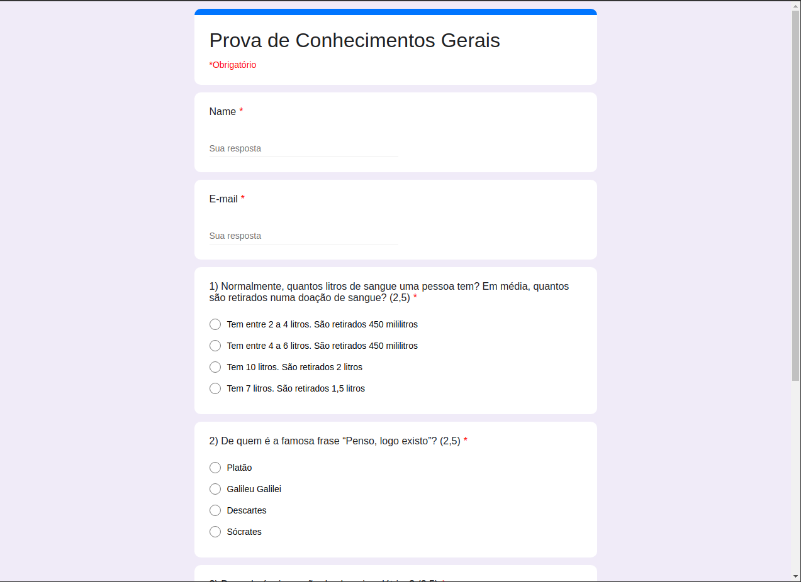

<h1 align="center">Forms Clone</h1>

 

  <a href="#rocket-tecnologias">Tecnologias</a>&nbsp;&nbsp;&nbsp;|&nbsp;&nbsp;&nbsp;
  <a href="#-projeto">Projetos</a>&nbsp;&nbsp;&nbsp;|&nbsp;&nbsp;&nbsp;
  <a href="#electric_plug-primeiros-passos">Primeiros Passos</a>

 

  

## :rocket: Tecnologias

Neste projeto usamos o `ReactJS` para montar todo o front-end junto com o `TypeScript` e o `json-server` para fazer uma fake API Rest.

## 💻 Projeto

Este é um projeto com fins de estudo sobre a plataforma do Google Forms :books:

## :electric_plug: Primeiros Passos

1. Clone este repositório usando: `https://github.com/joao-lucas-dev/forms-clone.git`
2. Mova para o diretório do projeto: `cd forms-clone`
3. Instale todas as dependências rodando no terminal: `yarn`
4. Rode `json-server server.json -p 8080` no terminal para poder utilizar a Fake API
6. Rode `yarn start` em outro terminal para iniciar a parte do ReactJS

